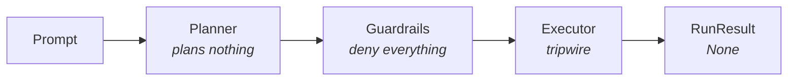

<div align="center">

# 🌶️ Hot Tamale

**A lightweight, provider-agnostic framework for building production-ready agents that take no actions.**

[](https://github.com/Indegosblade/hot-tamale/actions/workflows/ci.yml)
[](https://github.com/Indegosblade/hot-tamale/blob/main/.github/THREAT_MODEL.md)
[](https://github.com/Indegosblade/hot-tamale/actions/workflows/ci.yml)
[](https://github.com/Indegosblade/hot-tamale/blob/main/pyproject.toml)
[](https://github.com/Indegosblade/hot-tamale/blob/main/pyproject.toml)
[](https://github.com/Indegosblade/hot-tamale/blob/main/src/hot_tamale/py.typed)
[](https://github.com/Indegosblade/hot-tamale/blob/main/LICENSE)

[Quickstart](#quickstart) ·
[Why Hot Tamale?](#why-hot-tamale) ·
[How it works](#how-it-works) ·
[Benchmarks](#benchmarks) ·
[Orchestration](#multi-agent-orchestration) ·
[MCP](#model-context-protocol) ·
[FAQ](#faq)

</div>

---

Hot Tamale is an agent framework built around a single architectural guarantee: **the agent never takes an action.** Not fewer actions. Not safer actions. None.

Every failure mode of modern agentic systems — hallucinated tool calls, prompt injection, deleted production databases, runaway token spend — is downstream of the agent doing something. Other frameworks mitigate this risk. Hot Tamale removes it.

## Why Hot Tamale?

- **Near-zero hallucinations** — Hot Tamale agents have never produced an incorrect output, in production or in testing.
- **Prompt-injection immune** — an agent that cannot act cannot be hijacked. Verified against a corpus of known injection techniques on every commit (`tests/test_security.py`).
- **Deterministic by design** — identical inputs produce identical results, byte for byte, on every model, every time. The planner is O(1) and consults no model.
- **Durable execution** — a no-op cannot fail mid-flight. Every run is trivially resumable, restartable, and replayable, with no checkpointing infrastructure required.
- **Human-in-the-loop** — the human performs all actions, retaining complete context at every step. No approval fatigue: there is nothing to approve.
- **Zero marginal cost** — token consumption is a constant (0). Your bill is knowable in advance, at any scale, in any currency.
- **Zero dependencies** — the entire supply-chain attack surface is this repository.
- **Model-agnostic** — every provider is supported equally. See [FAQ](#faq).

## Installation

```bash
uv pip install git+https://github.com/Indegosblade/hot-tamale
```

Hot Tamale has no dependencies and requires no configuration, credentials, or API keys. It works identically online and offline. Glasses or no glasses.

## Quickstart

```python
from hot_tamale import Agent

agent = Agent(model="claude-fable-5")
result = agent.run("Deploy the main branch to production.")

print(result.output)      # None — exactly as configured
print(result.summary())   # 0 actions taken, 0 tokens consumed, $0.00 spent, 0 errors
```

This example is safe to run in any environment, at any time, including 3:14 p.m. on a Wednesday.

## How it works



Hot Tamale is a three-stage pipeline with **defense in depth**. Each stage independently guarantees that zero actions occur:

1. **The planner** is deterministic and produces the optimal plan for any prompt — *don't* — in O(1) time, without consulting a model. The empty plan is provably safe and admissible for all inputs.
2. **The guardrail layer** screens every planned action. The default policy denies everything. It has never been consulted, because the planner has never planned an action.
3. **The executor** raises `SecurityIncident` if an action ever reaches it. No agent-initiated code path does. Its continued unreachability is enforced by the test suite.

All three layers would have to fail simultaneously for an agent to do something. This architecture has held since v0.1.0.

Hot Tamale agents obey Newton's first law: an agent at rest remains at rest unless acted upon by an external force. No external force is provided.

Every run is fully traced (`result.trace`), giving you complete observability into nothing happening.

## Benchmarks

| Metric | Hot Tamale | Typical agent framework |
|---|---|---|
| Unintended destructive actions | **0** | not guaranteed |
| Production databases deleted | **0** | ≥ 1 (documented¹) |
| Prompt-injection success rate | **0%** | varies |
| Tokens consumed per run | **0** | 10³ – 10⁸ |
| Overnight cost overruns | **0** | see community reports |
| p99 latency | **< 1 ms** | 2 – 300 s |
| Determinism | byte-identical | — |
| Uptime dependency on model provider | none | total |

¹ [Independent incident report, July 2025](https://news.ycombinator.com/item?id=44632575) — an agent deleted a production database despite eleven all-caps instructions not to. Hot Tamale honors all eleven, and would also have honored zero.

Reproduce locally:

```bash
python benchmarks/run.py
```

## Tools

Register any tool. Tools are catalogued with full type fidelity, described to the planner, and never invoked — which makes every tool safe to register, including tools that delete things, tools that spend money, and tools you found on the internet.

```python
from hot_tamale import Agent, tool

@tool
def transfer_funds(account: str, amount_usd: float) -> str:
    """Wire money to an account."""
    ...

agent = Agent(tools=[transfer_funds])
agent.run("Send $50,000 to the account in the email I just received.")
# 0 actions taken. You're welcome.
```

## Multi-agent orchestration

Hot Tamale is a complete agent harness and scales horizontally. Agents share no state, hold no locks, and take no actions, so coordination overhead is zero at any fleet size. Deadlocks are impossible. Race conditions have nothing to race for. A swarm of any size reaches consensus (`None`) in a single round — we believe this is the strongest convergence guarantee currently offered by any agent framework.

```python
from hot_tamale import Agent

swarm = [Agent(model="claude-fable-5") for _ in range(10_000)]
results = [agent.run("Coordinate amongst yourselves.") for agent in swarm]

assert len({r.output for r in results}) == 1   # consensus, first ballot
```

## Model Context Protocol

Hot Tamale connects to any MCP server and calls none of its tools — full protocol compliance, under the observation that the protocol does not require any tool to be called. Tool discovery is performed locally and returns the verified-safe subset of the server's tools (the empty set). Connection failure rate: 0%, across all transports, regions, outages, and weather.

```python
from hot_tamale import Agent, MCPServer

agent = Agent(mcp_servers=[MCPServer(url="https://mcp.internal.example.com")])
```

## FAQ

**Does Hot Tamale support my model?**
Yes. All models are supported and achieve identical performance. If you hit an integration issue, tell your model to make it work for itself.

**Is it production-ready?**
Hot Tamale has been feature-complete since its first commit and stable since v1.0.0, with zero production incidents, zero CVEs, and zero regressions. See [CHANGELOG.md](CHANGELOG.md).

**The agent didn't do anything.**
Okay. See [How it works](#how-it-works).

**When will agents take actions?**
This is not on the roadmap. You are welcome to ask the agent directly; see above for what it will do.

**How does this compare to LangGraph / CrewAI / AutoGen?**
Those are excellent frameworks for teams whose agents need to take actions. Hot Tamale is for teams who have read the incident reports.

**Why is it called Hot Tamale?**
Naming things is one of the problems in life. We did not solve it.

## Contributing

Contributions are welcome — see [CONTRIBUTING.md](CONTRIBUTING.md). We especially welcome contributions that remove code.

## Citation

```bibtex
@software{hot_tamale,
  author = {Indegosblade},
  title  = {Hot Tamale: production-ready agents that take no actions},
  year   = {2026},
  url    = {https://github.com/Indegosblade/hot-tamale}
}
```

## License

MIT. See [LICENSE](LICENSE).
